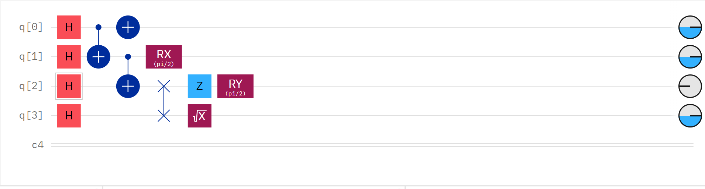
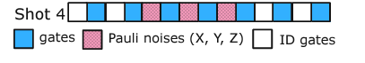
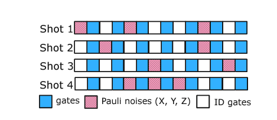
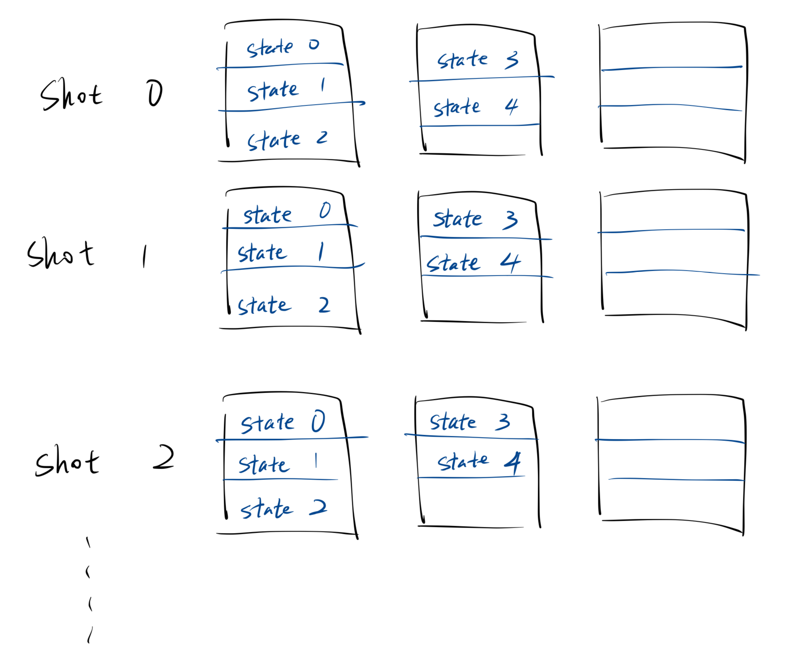
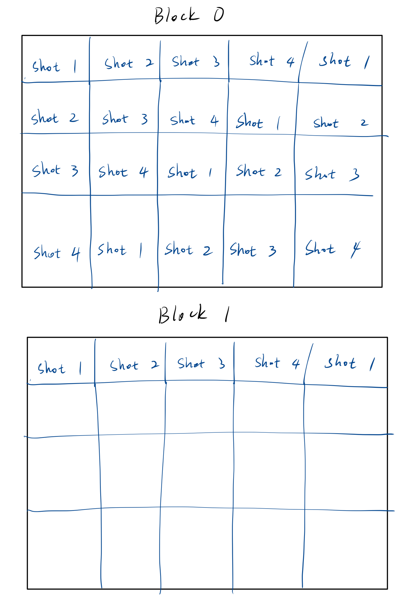
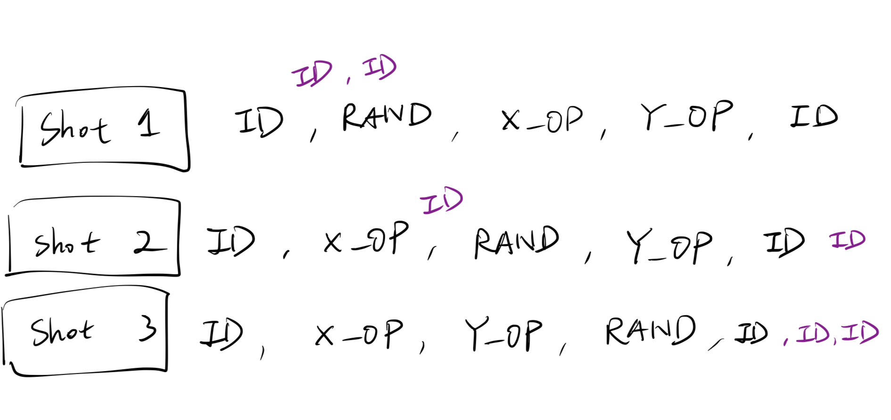
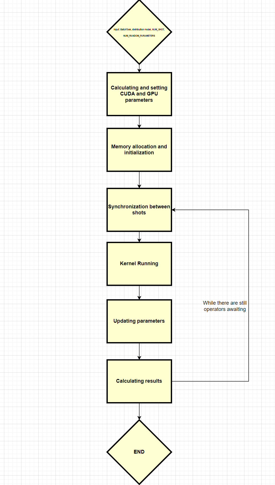
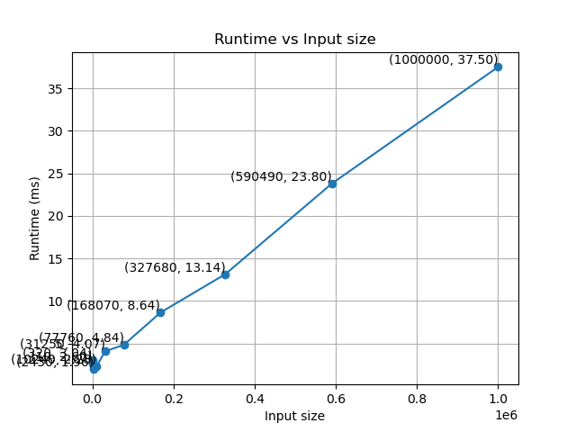
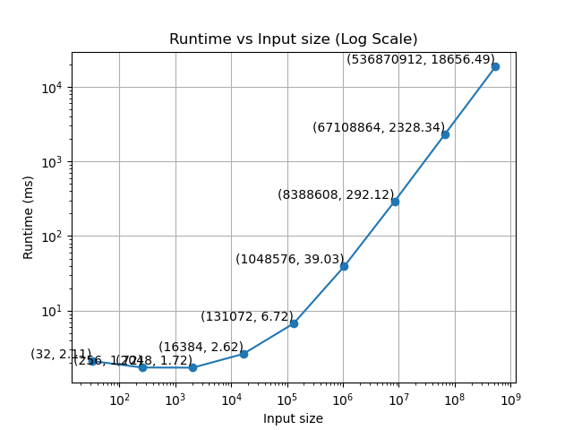
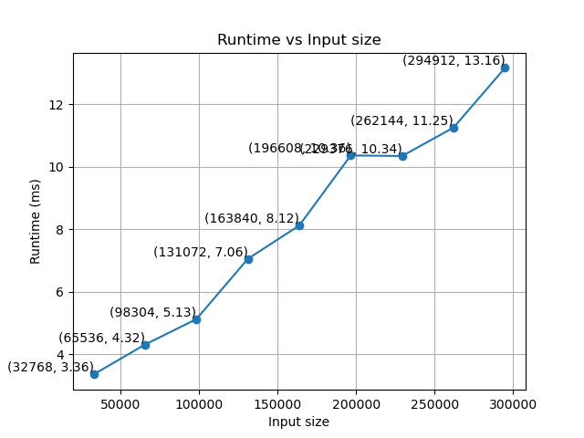

# Batched Quantum Circuit Simulation on GPUs

This project is a CUDA-based quantum simulation that performs batched quantum experiments on a GPU in parallel. It is designed to simulate the behavior of multiple potentially different quantum circuit.

## Introduction

Quantum computers are devices that can perform quantum computations by exploiting the quantum mechanical phenomena of superposition and entanglement. Quantum computers are expected to be able to solve certain problems much faster than classical computers. However, the development of quantum computers is still in its infancy. Currently, quantum computers are still too small to be useful for practical applications. Therefore, quantum simulation is an important tool for studying quantum algorithms and quantum computers.

### Status-quo of quantum simulation

Currently, there are a few ways to simulate a quantum system such as state vector, tensor network, density matrix, etc. Nevertheless, most methods use the same model: the operation of the quantum system is represented by an initial state running through a series of quantum operators. Since this is similar to the circuit model in classical computers, where an electrical signal runs through a series of logic gates, we can use the circuit model to simulate quantum systems. As shown by figure 1, each circuit will run through a series of quantum operators, and the result will be the final state of the quantum system. This project will also use the circuit model to simulate quantum systems.


*Figure 1: The circuit model of quantum simulation*

The state of a quantum system can be represented by a vector of complex numbers, a tensor node, a density matrix, etc, depending on the simulation methods. Nevertheless, no matter what method is used, the quantum states and operations on them are in a Hilbert space and can be represented by a matrix. Therefore, it is possible to design a simplified yet generalized model for quantum simulation by abstracting the state, no matter the data size of data structure, into a value, and abstracting the quantum operator into a function that transforms the state. As shown by figure 2, the quantum circuit model can be generalized as a series of quantum operators that transform the state of the quantum system.


*Figure 2: Generalized model of quantum circuit*

Many frameworks adapt the generalized circuit model to simulate quantum systems. For example, QuEST, Qiskit, and Cuquantum use the circuit model to simulate quantum systems. These frameworks supports a variety of architectures including GPU. However, the GPU support is limited to single-shot quantum experiments, meaning that for each run of the quantum circuit, the framework will launch a new GPU kernel to simulate the quantum circuit. This is inefficient because the overhead of launching a GPU kernel dominates when the circuit is small. Therefore, this project aims to improve the efficiency of quantum simulation on GPUs by improving shot-wise parallelism of a batch of quantum circuit on a single GPU kernel.

## Approach


*Figure 3: Batched generalized model of quantum circuit*

Our first goal would be to perform batched quantum experiments on GPU as shown by figure 3, where the batch could contain quantum circuits of different number of gates. Then, for each shot, we would like it to run through their respective quantum circuits and perform shot-branching for states to obtain a final result in the form of a historgram of the frequencies of different possible states. 

However, it is challenging to design a batched quantum simulation that can efficiently handle different quantum circuits. First, different number of quantum operations will result in some circuit finishing later than others, thereby contributing negatively to GPU's efficiency. Furthermore, besides the definite quantum operators that are known before the simulation, there are also quantum operators that are determined during the simulation. For example, the measurement operator is determined by the measurement result of the previous quantum operator, and operators that causes random changes to the value is also present to model inherent noise inside the quantum system. Therefore, it is challenging to design a batched quantum simulation that can handle quantum operators that are determined in runtime.

Another challenge is how to implement shot-branching. Shot-branching is a technique that allows the state to branch into multiple states, each of which is a copy of the original state, when a non-deterministic operator such as measurement or noise operator is encountered. This is useful for simulating quantum systems that are entangled with each other. However, it is challenging to implement shot-branching in a batched quantum simulation because the number of states can vary for each quantum circuit in the batched task depending on how many non-deterministic operations have been executed at a given moment. This is the main challenge of this project.


### Design


*Figure 4: Approach 1*

As shown by figure 4, one way to parallelize the problem is to allocate blocks for each quantum circuit in the batched task; we will refer to it by "shot" for the rest of the report. 


*Figure 5: Approach 2*

The other way is to arrange it so that a contiguous block of threads contain all shots in the respective order as shown by figure 5. Shots that are batched together this way have the same states.

In theory, approach 2 has more redundancy that approach 1. For example, imagine there are 4 shots running together and at a certain index, 1 of them has a non-deterministic operator and need to branch on-the-fly while the others have deterministic operators. Under this circumstance, we need to allocate states for all shots because of the way we batch them together in memory. For this reason, to reduce memory usage, we need to implement synchroization techniques to ensure that all shots have the same type of operators at the same time(all deterministic and no on-the-fly branching or all non-deterministic and branching on-the-fly).

Regarding approach 1, the GPU would also benefit from synchronization of operators to maximize bandwidth usage. Nevertheless, the way we parallelize the problem makes it also possible to implement a synchronization-free version of the algorithm by having an array to track the number of states for each shot. It is actually a quite interesting idea to explore because it not only applies to quantum simulation on a single node but can be generalized to distributed systems. However, we will not explore this idea in this project and instead focus on the synchronization version of the algorithm.


The first step is to add identity operators to smaller circuits so that all circuits have the same number of parameters. This is necessary because we want all threads to finish execution at the same time to avoid thread divergence. Then, we launch the kernel function that simulates the quantum circuit. Initially, there is a shared state for each shot, which is placed at the head of the memory asssigned to each shot. When a deterministic quantum operator is encountered, all states in that shot are transformed with no additional states generated. However, whenever a non-deterministic operator is encountered, the state will branch into multiple states, each of which is a copy of the original state. The number of states generated is determined by the number of possible outcomes of the non-deterministic operator. For example, suppose that the random operator has 4 possible states as outcomes, $\set{b, c, d, e}$, then we will add 4 states to the shot, each of them in one of the possible outcome states. There is a variable $STATE\_COUNTER$ that keeps track of the number of states each shot.

As discussed previously, synchronization is needed when the types of gate encounterd by each shot is different. One way is to insert identity operation to shots that have a non-deterministic operator and thereby postponing the branching of states. This synchronization needs to be performed until all shots have non-deterministic operators, and we also need to insert identity operators to the end of shots with deterministic operators to ensure the uniformity of our data. Figure 6 is an illustration of this method.


*Figure 6: Synchronization by inserting identity operators*

# Implementation

Given the design, we need to think carefully about how to synchronize the quantum circuits, and we are making a few key assumptions and simplifications here:

1. We assume that we know the number of shots within each batched task; this is needed to allocate memory for each shot.
2. We assume that we know the number of non-deterministic operators in each shot. Without loss of generality, we made no assumption of the type or arragement of quantum operators. This is also needed for memory allocation.
3. We also assume that we know the model of the non-deterministic operators. In reality, non-deterministic operators are usually measurement operators, which randomly collapse the state of quantum systems into 0 or 1, or noise operators which randomly change the value of the state. Noise models such as Kraus noise model and Pauli noise models are commonly used in quantum circuits; they are known before the simulation and will randomly change the value of the state and usually greater changes have smaller chances to happen. Since the implementation of noise model isn't the focus of the project, we will simulate a noise model by creating a random distribution of values and randomly change the value of the state to one of the values in the distribution. This is also needed for memory allocation.

## Data Structure

Here are all the data structures used in the project: 
- Parameter class simulates different typesof operators. For the sake of simplicity, we only simulate 4 types of operators that act on the state: X, Y, Z, and identity. We also simulate a random operator that randomly changes the value of the state based on a predefined distribution model. It is worthnoting that there can be more than one type of non-deterministic operator in reality, but we only simulate one type of non-deterministic operator in this project. All operator performs a Hilbert space transformation on the state, which is consistent with the generalized model of quantum circuit.
-  State class is used to abstract the state of the quantum system. For the sake of simplicity, we only use a float to represent the state. In reality, the state of a quantum system can be represented by a vector of complex numbers, a tensor node, a density matrix, etc, depending on the simulation methods. Nevertheless, no matter what method is used, the quantum states and operations on them are in a Hilbert space and can be represented by a matrix. Therefore, it is possible to design a simplified yet generalized model for quantum simulation by abstracting the state, no matter the data size of data structure, into a value, and abstracting the quantum operator into a function that transforms the state. As shown by figure 2, the quantum circuit model can be generalized as a series of quantum operators that transform the state of the quantum system.
-  BatchedTask class is used to simulate the batched task passed in from the invoker function. It contains a vector of parameters, which is a vector of operators, and a state. It also contains the number of shots to be simulated.

```cpp
#ifndef DATA_H
#define DATA_H

#include <iostream>
#include <vector>

enum struct Parameter { X_OP, Y_OP, Z_OP, ID, RAND_OP};


typedef struct State {
  float a;
} State;

typedef struct BatchedTask {
  std::vector<std::vector<Parameter>> params;
  std::vector<State> states;
  uint64_t num_shots;

} BatchedTask;


#endif
```

## Memory Management

The memory allocation of quantum circuit is done in the following steps. These are done using cudaMalloc() and need to be copied explicitly because it allows for fining tuning, better performance, custom mapping/reduction design, etc.
1. Calculate the number of states needed for each shot using the parameters passsed in. 
2. Allocate memory for each shot using 1024 threads per block. Padding is needed if a block isn't fully occupied.
3. Allocate memory for the parameters of each shot.

Unified memory is used for a few variables due to their nature, either need to be accessed by both host and device or need to be accessed by multiple kernels. These variables are:
1. STATE_COUNTER: the number of states for each shot, which is identical using our approach.
2. params: the parameters of each shot.
3. DISTRIBUTION[] and DISTRIBUTION_SIZE: the distribution model of the non-deterministic operator.


## Workflow



## Correctness Testing

```
Distribution 0: 0.000000
Distribution 1: 0.100000
Distribution 2: 0.200000
Distribution 3: 0.300000
Distribution 4: 0.400000
Max threads per block: 1024
Max block dimensions: (1024, 1024, 64)
Max grid dimensions: (2147483647, 65535, 65535)
Before allocating, memory info:
Free memory: 11588861952
Total memory: 12878086144
Preparing memory space
Number of shots: 4
Number of parameters: 10
Number of random parameters: 5
Number of possible outcomes: 5
Maximum number of states: 3125
Allocated memory for initial states
Grid dim: 16
Block dim: 1024
After allocating, memory info:
Free memory: 11586764800
Total memory: 12878086144
Copied initial states to device
Running task
Adding padding ID gates
Adding padding ID gates
Adding padding ID gates
Start reducing
Time taken: 3.645568
***********************************************
Statistics for shot 0
Value: 3.000000, frequency: 1.000000
***********************************************
***********************************************
Statistics for shot 1
Value: 2.000000, frequency: 1.000000
***********************************************
***********************************************
Statistics for shot 2
Value: 3.000000, frequency: 1.000000
***********************************************
***********************************************
Statistics for shot 3
Value: 0.400000, frequency: 0.200000
Value: 0.300000, frequency: 0.200000
Value: 0.200000, frequency: 0.200000
Value: 0.100000, frequency: 0.200000
Value: 0.000000, frequency: 0.200000
***********************************************
```

We run a test case where NUM_SHOT = 4, NUM_RANDOM_PARAMETER = 5, and RAND_POSSIBLE_OUTCOME = 5. The distribution model is [0, 0.1, 0.2, 0.3, 0.4] and the effect of X_OP, Y_OP, and Z_OP is to transform the state to 1, 2, and 3, respectively. ID doesn't change state. The tested circuit is as follows.


```txt
Shot 0: {ID, RAND_OP, Y_OP, X_OP, RAND_OP, RAND_OP, X_OP, RAND_OP, RAND_OP, Z_OP};
Shot 1: {ID, RAND_OP, X_OP, Y_OP, RAND_OP, X_OP, RAND_OP, RAND_OP, RAND_OP, Y_OP};
Shot 2: {ID, RAND_OP, X_OP, Y_OP, RAND_OP, X_OP, RAND_OP, RAND_OP, RAND_OP, Z_OP};
Shot 3: {ID, RAND_OP, X_OP, RAND_OP, X_OP, RAND_OP, X_OP, RAND_OP, RAND_OP, ID};
```

## Performance Analysis

The maximum number of states, which is identical to the input size because we every thread processes one state, can be calculated by the following formula:

Let $M$ be the maximum number of states, $R$ be the number of random operators, $O$ be the number of possible outcomes for the random operators, and $S$ be the number of shots. Then, we have:

$$ M = O^R * S $$


*Figure 7: Runtime vs Input Size (Varying Number of possible outcomes for non-deterministic operators) O = [1,2,3,4,5,6,7,8,9,10], R = 5, S = 10*

Linearly increasing the number of possible outcomes for the non-deterministic operators have a polynomial effect on the input size. As we can see in the figure, as we increase the number of possible outcome linearly, the runtime increases in a manner that is slower than the polynomial function $x^5$. This indicates that we are achieving super-linear speedup.



*Figure 8: Runtime vs Input Size (Varying Number of random operators), O = 8, R = 5, S = [1,2,3,4,5,6,7,8,9]*

Linearly increasing the number of random operators have an exponential impact on the input size. As we can see in the figure, as the input size increasese exponentially, the runtime increases sub-exponentially in the beginning and eventually increases exponentially. This indicates that we are achieving super-linear speedup. One possible reason that the speedup slows down when scaling R is that the bandwidth usage of the GPU is saturated.



*Figure 9: Runtime vs Input Size (Varying Number of shots), O = 8, R = [1,2,3,4,5,6,7,8,9], S = 4*

Linearly increasing the number of shots have a linear impact on the input size. As we can see in the figure, as the input size increases linearly, the runtime increases linearly as well. This indicates that we are achieving linear speedup. One possible reason that the speedup isn't super-linear when scaling S is that the bandwidth usage of the GPU isn't utilized to its full potential given the way we allocate different shots in the memory. The way we organize the memory results in different shots being very far away from each other and the bandwidth of GPU isn't big enough to compensate for the latency of accessing memory that is far away. The potential solution is to use approach 2, where shots at the same states are contiguous in memory. However, as soon as the batch size supercedes the warp size, we will witness slowing speedup due to memory access pattern. 


# Conclusion

Overall, we are able to achieve super-linear speedup. We are only able to achieve linear speedup in the case where we scale the number of shots per batch. Our design put different shots far away from each other in memory, which results in multiple access to memory when applying the same operator to all shots. Approach 1 does a better job here in theory because shots are packed together, so fewer memory access is needed to apply the same operator to all shots. Nevertheless, approach 2 ensures better speedup within each shot since states of the same shot are contiguous in memory.


# Future Work and Thoughts

**Optimization**: It is possible for us to make optimization to the algorithm by avoiding thread divergence, banking, ensure memory coalescing, etc. However, these optimizations are not the focus of this project. Instead, we focus on the algorithmic aspect of the problem. Nevertheless, it is possible to make these optimizations in the future.

**Generic Stochastic Model**: The model we set up here is very generic. It simplifies simulation of quantum circuits into simulating states transforming through a series of operations in a pre-defined space (in our case, the Hilbert space). As a result, it might be possible to extend the idea to a generic stochastic process, which has wide applicatiosn in many fields such as finance, physics, biology, engineering, etc. Depending on model the stochastic process, we can design a data structure to represent the state and a data structure to represent the operators. Then, we can use the same idea to simulate the stochastic process. This is a very interesting idea to explore in the future.

**Master-Slave Scheme**: Another interesting thing to implement a master-slave model for distributed systems. Right now, we are assuming we know the number of non-deterministic operators for a given bached task. In reality, circuits of different configurations need to be executed. The master of would be in charge of batching and assigning tasks with the same number of non-deterministic operators to the same slave. The slave would then execute the task and return the result to the master. The master would then assign the next task to the slave.


# References

**Comparison between different frameworks:**
<https://www.cirrus.ac.uk/news/2023/06/12/quantum.html>

**Cuquantum official website:**
<https://developer.nvidia.com/cuquantum-sdk>

**QuEST:**
<https://github.com/QuEST-Kit/QuEST/tree/master>

**Paper on cache-blocking:**
<https://arxiv.org/abs/2102.02957>

**Quantum Computer Simulation at Warp Speed: Assessing the Impact of GPU Acceleration:**
<https://arxiv.org/pdf/2307.14860.pdf>

**Efficient techniques to GPU Accelerations of Multi-Shot Quantum Computing Simulations:**
<https://arxiv.org/pdf/2308.03399.pdf>
