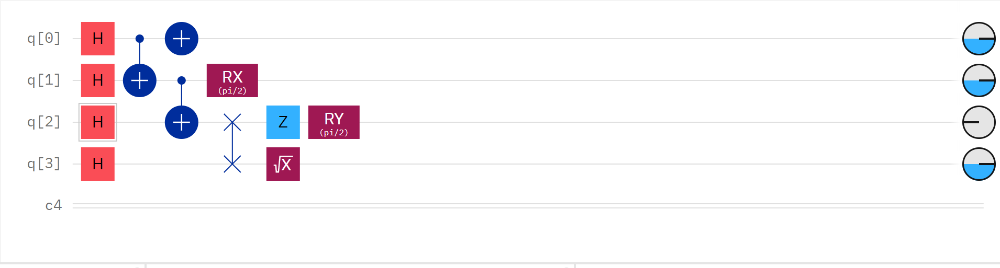
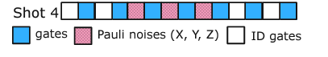
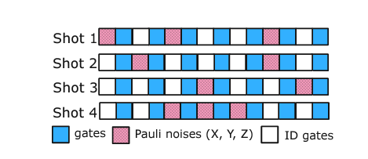
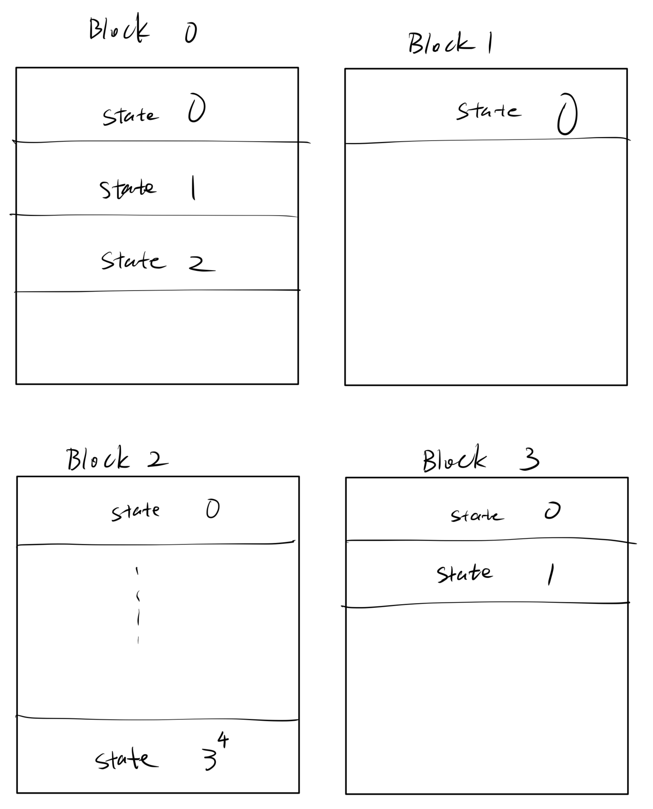
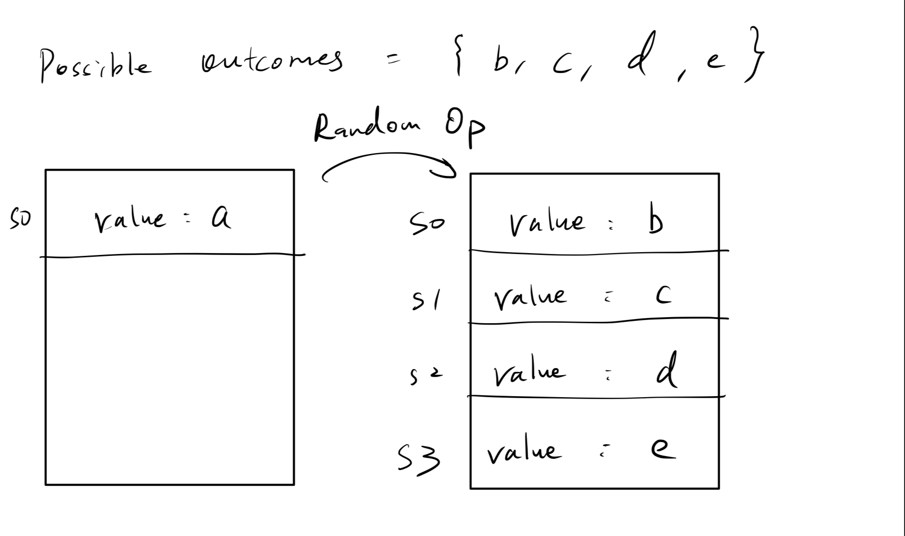
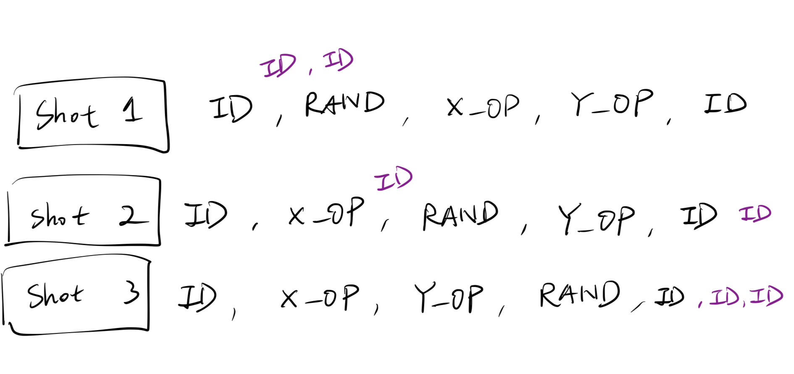

# Batched Quantum Circuit Simulation on GPUs

This project is a CUDA-based quantum simulation that performs batched quantum experiments on a GPU in parallel. It is designed to simulate the bahevior of multiple potentially different quantum circuit.

## Introduction

Quantum computers are devices that can perform quantum computations by exploting the quantum mechanical phenomena of superposition and entanglement. Quantum computers are expected to be able to solve certain problems much faster than classical computers. However, the development of quantum computers is still in its infancy. Currently, quantum computers are still too small to be useful for practical applications. Therefore, quantum simulation is an important tool for studying quantum algorithms and quantum computers.

### Status-quo of quantum simulation

Currently, there are a few ways to simulate a quantum system such as state vector, tensor network, density matrix, etc. Nevertheless, most methods use the same model: the operation of the quantum system is represented by an initial state running through a series of quantum operators. Since this is similar to the circuit model in classical computers, where an electron runs through a series of logic gates, we can use the circuit model to simulate quantum systems. As shown by figure 1, each circuit will run through a series of quantum operators, and the result will be the final state of the quantum system. THis project will also use the circuit model to simulate quantum systems.


*Figure 1: The circuit model of quantum simulation*

The state of a quantum system can be represented by a vector of complex numbers, a tensor node, a density matrix, etc, depending on the simulation methods. Nevertheless, no matter what method is used, the quantum states and operations on them are in a Hilbert space and can be represented by a matrix. Therefore, it is possible to design a simplified yet generalized model for quantum simulation by abstracting the state, no matter the data size of data structure, into a value, and abstracting the quantum operator into a function that transforms the state. As shown by figure 2, the quantum circuit model can be generalized as a series of quantum operators that transform the state of the quantum system.


*Figure 2: Generalized model of quantum circuit*

Many frameworks adapt the generalized circuit model to simulate quantum systems. For example, QuEST, Qiskit, and Cuquantum use the circuit model to simulate quantum systems. These frameworks supports a variety of architectures including GPU. However, the GPU support is limited to single-shot quantum experiments, meaning that for each run of the quantum circuit, the framework will launch a new GPU kernel to simulate the quantum circuit. This is inefficient because the overhead of launching a GPU kernel dominates when the circuit is small. Therefore, this project aims to improve the efficiency of quantum simulation on GPUs by improving shot-wise parallelism of a batch of quantum circuit on a single GPU kernel.

## Approach


*Figure 3: Batched generalized model of quantum circuit*

Our first goal would be to perform batched quantum experiments on GPU, where the batch could contains quantum circuits of different number of gates. Then, for each shot, we would like it to run through their respective quantum circuits and perform shot-branching for states so that we can obtain a final result in the form of a historgram of the frequencies of different possible states. 

However, it is challenging to design a batched quantum simulation that can efficiently handle different quantum circuits. First, different number of quantum operations will result in some circuit finishing later than others, thereby contributing negatively to GPU's efficiency. Furthermore, besides the definite quantum operators that are known before the simulation, there are also quantum operators that are determined during the simulation. For example, the measurement operator is determined by the measurement result of the previous quantum operator, and operators that causes random changes to the value is also present to model sent noise inside the quantum system. Therefore, it is challenging to design a batched quantum simulation that can handle quantum operators that are determined in runtime.

Another challenge is how to implement shot-branching. Shot-branching is a technique that allows the state to branch into multiple states, each of which is a copy of the original state, when a non-deterministic operator such as measurement or noise operator is encountered. This is useful for simulating quantum systems that are entangled with each other. However, it is challenging to implement shot-branching in a batched quantum simulation because the number of states can vary for each quantum circuit in the batched task depending on how many non-deterministic operations have been executed at a given moment. This is the main challenge of this project.


### Design

Given the two major challenges, we need to think carefully about how to sychronize the quantum circuits, and we are making a few key assumptions and simplifications here:

1. We assume that we know the number of shots within each batched task
2. We assume that each shot has deterministic operators  as its' first and last operation.
3. We assume that we know the number of non-deterministic operators in each shot. Without loss of generality, we made no assumption of the type or arragement of quantum operators.
4. We also assume that we know the distribution and parameters of each non-deterministic operator, meaning that we know all possible outcome of each non-deterministic operator and the probability of each outcome.


*Figure 4: shot-wise parallelism of batched quantum circuit with each block representing a different shot*

As shown by figure 4, one way to parallelize the problem is to allocate one block for each quantum circuit in the batched task; we will refer to it by "shot" for the rest of the report. Each thread will contain states for the respective shot. We can thus refer to different shots using $blockIdx.x$ and refer to different states of a shot using $threadIdx.x$.



*Figure 5: Encountering a non-deterministic operator*

The first step is to add identity operators to smaller circuits so that all circuits have the same number of parameters. This is necessary because we want all threads to finish execution at the same time to avoid thread divergence. Then, we launch the kernel function that simulates the quantum circuit. Initially, there is a shared state for each shot, which is placed at the head of each block ($threadIdx.x = 0$). When a deterministic quantum operator is encountered at a specific shot, all states in that shot are transformed with no additional states generated. However, whenever a non-deterministic operator is encountered, the state will branch into multiple states, each of which is a copy of the original state. The number of states generated is determined by the number of possible outcomes of the non-deterministic operator. For example, suppose that the random operator has 4 possible states as outcomes, $\set{b, c, d, e}$, then we will add 4 states to the shot, each of them in one of the possible outcome states. There is a variable $STATE_COUNTER$ that keeps track of the number of states each shot.

However, this leads to another problem, what if some shots have non-deterministic operators while others do not? In this case, $STATE_COUNTER$ cannot be updated to avoid bac memory access and synchronization is needed. There are 2 ways to do this. The first one is to insert identity operation to shots that have a non-deterministic operator and thereby postponing the branching of states. This synchronization needs to be performed until all shots have non-deterministic operators, and we also need to insert identity operators to the end of shots with deterministic operators to ensure the uniformity of our data. Figure 6 is an illustration of this method.


*Figure 6: Synchronization by inserting identity operators*


# Implementation

## Data Structure

```cpp
#ifndef DATA_H
#define DATA_H

#include <iostream>
#include <vector>

enum struct Parameter { X_OP, Y_OP, Z_OP, ID, RAND_OP};


typedef struct State {
  float a;
} State;

typedef struct BatchedTask {
  std::vector<std::vector<Parameter>> params;
  std::vector<State> states;
  uint64_t num_shots;

} BatchedTask;


typedef struct Task {
  std::vector<Parameter> params;
  State state;
  uint64_t num_shots;

} Task;

#endif
```

The invoker will pass a batched task to the simulator as well as other required parameters such as distribution and possible outcomes of non-deterministic operators.


# References

**Comparison between different frameworks:**
<https://www.cirrus.ac.uk/news/2023/06/12/quantum.html>

**Cuquantum official website:**
<https://developer.nvidia.com/cuquantum-sdk>

**QuEST:**
<https://github.com/QuEST-Kit/QuEST/tree/master>

**Paper on cache-blocking:**
<https://arxiv.org/abs/2102.02957>

**Quantum Computer Simulation at Warp Speed: Assessing the Impact of GPU Acceleration:**
<https://arxiv.org/pdf/2307.14860.pdf>

**Efficient techniques to GPU Accelerations of Multi-Shot Quantum Computing Simulations:**
<https://arxiv.org/pdf/2308.03399.pdf>
